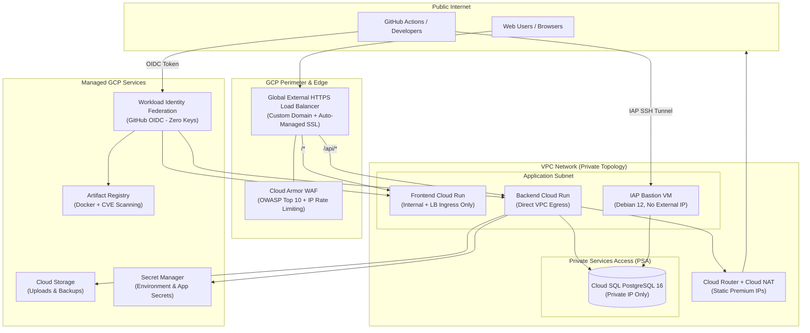

# Enterprise GCP Infrastructure Boilerplate 🚀

A production-ready, security-hardened Google Cloud Platform (GCP) infrastructure boilerplate provisioned with **Terraform**, automated with **GitHub Actions**, and authenticated with **Workload Identity Federation (WIF)**.

Designed for modern web applications and microservices (FastAPI, Express, Django, Next.js, Go, Rails, etc.), this repository provisions a multi-environment, zero-trust cloud architecture in minutes.

---

## 🏗 Architecture Overview



### Key Architectural Highlights
- **Zero-Trust Security**: No service account JSON keys are ever generated. GitHub Actions authenticates directly with Google Cloud via OIDC and Workload Identity Federation.
- **Private Cloud SQL**: PostgreSQL instance has **no public IP**. It communicates exclusively over Private Services Access (PSA) with Cloud Run Direct VPC egress.
- **Developer Bastion via IAP**: Secure local database access (psql, DBeaver, DataGrip) via an Identity-Aware Proxy (IAP) bastion VM without public IP exposure (`./scripts/db-iap-tunnel.sh`).
- **Cloud Armor WAF**: Layer 7 DDoS mitigation and pre-configured OWASP CRS 3.3 rules (SQLi, XSS, RCE, LFI/RFI) with client rate limiting and optional corporate IP allowlisting.
- **Automated Database Backups**: Offloaded daily compressed SQL exports stored in Google Cloud Storage via Cloud Workflows and Cloud Scheduler.
- **Secret Manager Integration**: All application settings and database connection strings are injected via Secret Manager (no plaintext manifest env variables).

---

## 📁 Repository Structure

```text
├── .github/
│   └── workflows/
│       ├── terraform-plan.yml      # Automated plan on Pull Requests
│       └── terraform-apply.yml     # Automated apply on push to dev/main
├── scripts/
│   ├── bootstrap.sh                # 1-command GCP & GitHub WIF setup
│   └── db-iap-tunnel.sh            # Local DB port-forwarding via IAP
├── examples/
│   ├── github-actions/             # Deploy workflows for Backend & Frontend repos
│   └── bitbucket/                  # Reference pipelines for Bitbucket users
├── terraform/
│   ├── main.tf                     # Root module orchestration
│   ├── variables.tf                # Root variable definitions & toggles
│   ├── outputs.tf                  # Root outputs
│   ├── backends/                   # Remote state bucket configuration
│   │   ├── dev.hcl                 # Dev/Staging backend
│   │   └── prod.hcl                # Production backend
│   ├── envs/                       # Environment-specific input values
│   │   ├── dev.tfvars              # Dev/Staging stack configuration
│   │   └── prod.tfvars             # Production stack configuration
│   └── modules/
│       ├── shared/                 # APIs, Artifact Registry & scan gates
│       ├── network/                # VPC, subnets, PSA, Cloud NAT
│       ├── bastion/                # IAP bastion VM & firewall rules
│       ├── backend/                # Cloud SQL, Secret Manager, Cloud Run API & Jobs
│       ├── frontend/               # Cloud Run Web service
│       └── load_balancer/          # Global HTTPS LB, Cloud Armor WAF, SSL certs
├── COMMANDS.md                     # CLI operational runbook
├── VARIABLES.md                    # Complete variable inventory & reference
└── README.md
```

---

## ⚡ Quickstart Guide (Zero to Live in 5 Steps)

### Step 1: Clone Repository & Create GCP Project
1. Create a Google Cloud Project (or two for `staging` and `production`) in the [GCP Console](https://console.cloud.google.com/) and attach billing.
2. Clone this repository:
   ```bash
   git clone https://github.com/YOUR_ORG/YOUR_REPO.git
   cd YOUR_REPO
   ```

### Step 2: Run the 1-Command Bootstrap
Run the automated bootstrap script to enable core APIs, create the Terraform state bucket, and configure GitHub Actions Workload Identity Federation:

```bash
./scripts/bootstrap.sh [GCP_PROJECT_ID] [GITHUB_OWNER/GITHUB_REPO] [REGION]
```

*Example:*
```bash
./scripts/bootstrap.sh my-company-dev my-org/my-infra us-central1
```

The script outputs the required GitHub repository secrets. Add them to:
**GitHub Repository → Settings → Secrets and variables → Actions**.

### Step 3: Configure Environment Variables
Edit `terraform/envs/dev.tfvars`:
- Adjust `name_prefix`, `region`, and resource sizes.
- Enable or disable components (`enable_frontend`, `enable_ai_apis`, `enable_migration_job`).
- Add developer emails to `bastion_operator_members` for local database access.

### Step 4: Deploy Infrastructure

#### Option A: Via GitHub Actions (Recommended)
Push your code or open a Pull Request:
- Push to `dev` branch → Deploys **Staging** (`envs/dev.tfvars`).
- Push to `main` branch → Deploys **Production** (`envs/prod.tfvars`).

#### Option B: Via Local Terminal
```bash
cd terraform
terraform init -reconfigure -backend-config=backends/dev.hcl
terraform plan -var-file=envs/dev.tfvars
terraform apply -var-file=envs/dev.tfvars
```

### Step 5: Configure Application Secrets & Custom Domain
1. **Set Application Secrets**:
   Terraform initializes secrets in Secret Manager with `REPLACE_ME` placeholders.
   Navigate to **GCP Console → Secret Manager** to set the real values (e.g. `DATABASE_URL` password, `JWT_SECRET`).
2. **Point DNS**:
   Retrieve the load balancer IP:
   ```bash
   cd terraform && terraform output web_lb_ip
   ```
   Add a DNS **A** record pointing your domain (e.g. `app.yourdomain.com`) to `web_lb_ip`. Google automatically provisions and renews the managed SSL certificate.

---

## 💻 Local Database Access (IAP Tunnel)

Because Cloud SQL has no public IP, developers connect through the IAP bastion:

1. Add your Google email in `terraform/envs/dev.tfvars`:
   ```hcl
   bastion_operator_members = [
     "user:developer@example.com"
   ]
   ```
2. Open the secure tunnel:
   ```bash
   ./scripts/db-iap-tunnel.sh
   ```
3. Connect your favorite database client (psql, DBeaver, DataGrip):
   ```text
   Host: 127.0.0.1
   Port: 5433
   Database: app_db
   User: <from Secret Manager>
   Password: <from Secret Manager>
   SSL: Require
   ```

---

## 🚢 Deploying Applications to Cloud Run

Templates for deploying backend APIs and frontend SPAs are provided in `examples/github-actions/`:
- `examples/github-actions/backend-deploy.yml`: Builds Docker container, scans for CVEs, runs database migrations, and updates Cloud Run.
- `examples/github-actions/frontend-deploy.yml`: Builds frontend assets and updates Cloud Run.

Copy them to your application repositories under `.github/workflows/deploy.yml`.

---

## 📖 Documentation
- [VARIABLES.md](VARIABLES.md): Comprehensive inventory of all Terraform inputs, defaults, and secrets.
- [COMMANDS.md](COMMANDS.md): CLI reference for Day-2 operations, troubleshooting, and verification.

---

## 📄 License
This project is open-source and available under the [MIT License](LICENSE).
